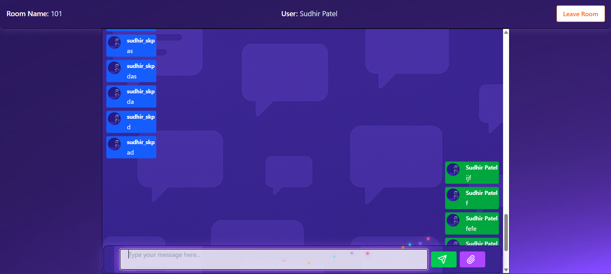
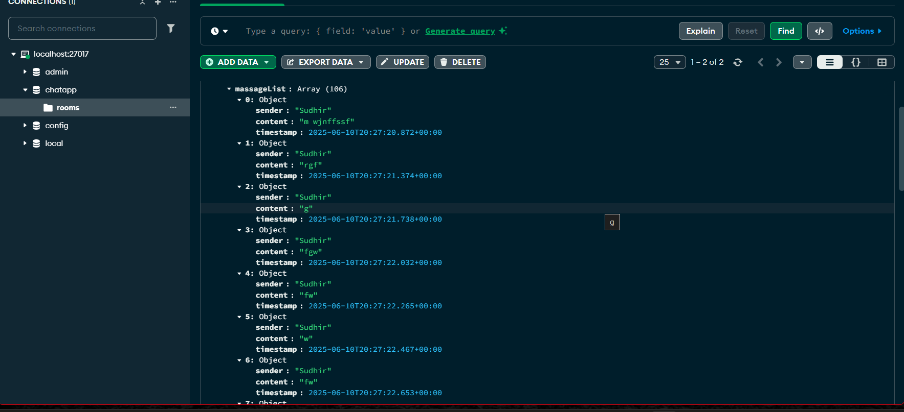

# ChatApp

A real-time chat application built using **Spring Boot** and **MongoDB**. This application allows users to create, join, leave, and close chat rooms, as well as send and retrieve messages.

## Note : 
Frontend Code : frontend
Backend Code : chatApp
## Create and Join the Room


## Chat-Page


## Database


## Features

- **Room Management**:
  - Create chat rooms.
  - Join existing chat rooms.
  - Leave chat rooms.
  - Close chat rooms (deletes all messages and the room itself).

- **Messaging**:
  - Send and retrieve messages in a chat room.
  - Paginated retrieval of messages.

- **Room Details**:
  - Get room details such as creator and closed status.

## Technologies Used

- **Backend**: Java, Spring Boot
- **Database**: MongoDB
- **Build Tool**: Maven

## Project Structure

```
src/main/java/spring/chat/app/chatapp/
├── Controller/         # REST API controllers
├── entities/           # Entity classes (Room, Message, etc.)
├── Repo/               # Repository interfaces for MongoDB
└── ChatappApplication.java  # Main application entry point
```

## API Endpoints

### Room Management
- **Create Room**: `POST /api/v1/rooms`
- **Join Room**: `GET /api/v1/rooms/{roomId}`
- **Leave Room**: `POST /api/v1/rooms/app/leaveRoom/{roomId}`
- **Close Room**: `DELETE /api/v1/rooms/app/closeRoom/{roomId}`

### Messaging
- **Get Messages**: `GET /api/v1/rooms/{roomId}/messages`

### Room Details
- **Get Room Details**: `GET /api/v1/rooms/{roomId}/details`

## Setup Instructions

1. **Clone the Repository**:
   ```bash
   git clone <repository-url>
   cd chatapp
   ```

2. **Configure MongoDB**:
   - Ensure MongoDB is installed and running locally or provide a connection string in the `application.properties` file.

3. **Build the Project**:
   ```bash
   mvn clean install
   ```

4. **Run the Application**:
   ```bash
   mvn spring-boot:run
   ```

5. **Access the Application**:
   - The application will be available at `http://localhost:8080`.

## Example Request

### Create a Room
```bash
POST /api/v1/rooms
Content-Type: application/json

"roomId123"
```

### Response
```json
{
  "id": "64f1c2e5b5d3c",
  "roomId": "roomId123",
  "massageList": []
}
```

## Contributing

1. Fork the repository.
2. Create a new branch for your feature or bug fix.
3. Submit a pull request with a detailed description of your changes.

## License

This project is licensed under the MIT License. See the `LICENSE` file for details.
