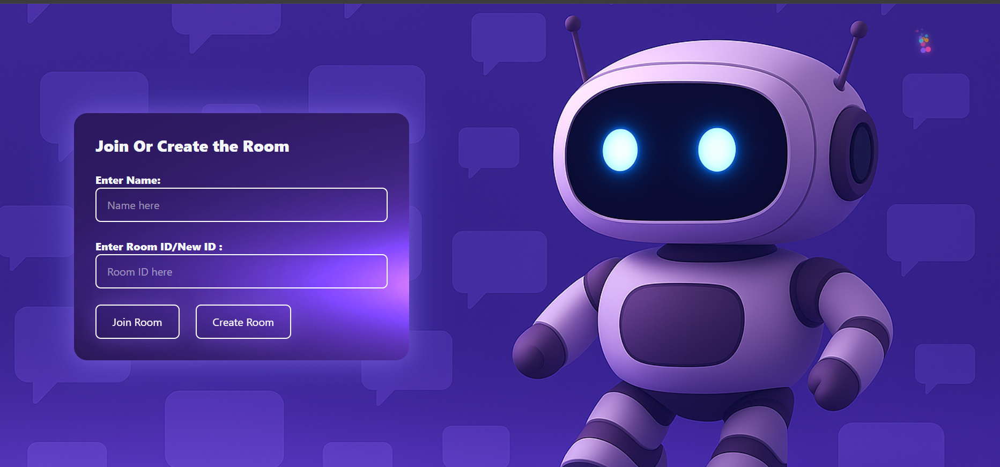

# ChatApp

A real-time chat application built using **Spring Boot**, **MongoDB**, and deployed using **Docker + Nginx + HTTPS** on a DigitalOcean droplet.  
Users can create, join, leave, and close chat rooms, as well as send and retrieve messages in real time.

---

## 🔗 Live Demo  
**Frontend (Netlify):** https://courageous-cheesecake-916884.netlify.app/  
**Backend API (HTTPS) Test here :** https://skproom.me/api/v1/rooms/demo%20backend

**Frontend Code:** `/frontend`  
**Backend Code:** `/chatApp`

🖥️ **Supports:** Desktop/Laptop only

---

## 📸 Screenshots

### ➤ Create & Join Room  


### ➤ Chat Page  


### ➤ MongoDB Collections  


---

# 🚀 Features

### 🏠 Room Management
- Create chat rooms  
- Join existing rooms  
- Leave rooms  
- Close rooms (removes room + all messages)

### 💬 Messaging
- Send text messages  
- Fetch messages with pagination  

### 📑 Room Details
- Get room creator  
- Get room closed/open status  

---

# 🛠️ Technologies Used

- **Backend:** Java, Spring Boot  
- **Database:** MongoDB  
- **Build Tool:** Maven  
- **Deployment:** Docker, DigitalOcean Droplet  
- **Reverse Proxy:** Nginx  
- **SSL/TLS:** Let's Encrypt (Certbot)  
- **Frontend Hosting:** Netlify  

---

# 📁 Project Structure


````
src/main/java/spring/chat/app/chatapp/
├── Controller/               # REST controllers
├── entities/                 # Room, Message classes
├── Repo/                     # MongoDB repository interfaces
└── ChatappApplication.java   # Main Spring Boot entry point

````
# 🌐 API Endpoints

## 🏠 Rooms
| Action          | Method | Endpoint |
|-----------------|--------|----------|
| Create Room     | POST   | `/api/v1/rooms` |
| Join Room       | GET    | `/api/v1/rooms/{roomId}` |
| Leave Room      | POST   | `/api/v1/rooms/app/leaveRoom/{roomId}` |
| Close Room      | DELETE | `/api/v1/rooms/app/closeRoom/{roomId}` |

## 💬 Messaging
| Action          | Method | Endpoint |
|-----------------|--------|----------|
| Get Messages    | GET    | `/api/v1/rooms/{roomId}/messages` |

## 📑 Room Details
| Action               | Method | Endpoint |
|----------------------|--------|----------|
| Get Room Details     | GET    | `/api/v1/rooms/{roomId}/details` |

---

# ⚙️ Setup (Local Development)

### 1️⃣ Clone the Repository
```bash
git clone <repository-url>
cd chatapp
````

### 2️⃣ Configure MongoDB

* Run a local MongoDB instance
  **OR**
* Add your connection string in `application.properties`.

### 3️⃣ Build the Project

```bash
mvn clean install
```

### 4️⃣ Run the Application

```bash
mvn spring-boot:run
```

### 5️⃣ Access App

```
http://localhost:8080
```

---

# 🧪 Example Request

### Create a Room

```http
POST /api/v1/rooms
Content-Type: application/json

"roomId123"
```

### Example Response

```json
{
  "id": "64f1c2e5b5d3c",
  "roomId": "roomId123",
  "massageList": []
}
```

---

# 🌍 Deployment Overview (DigitalOcean)

This project uses:

* Docker container → `suddoc101/chatback:v1.1`
* Nginx reverse proxy
* Custom domain: **skproom.me**
* HTTPS via Let's Encrypt
* Frontend on **Netlify**

### Summary:

> Deployed Spring Boot backend using Docker on DigitalOcean, configured Nginx reverse proxy, added free HTTPS using Certbot, and linked custom domain `skproom.me`. Frontend communicates securely over HTTPS without mixed-content issues.

---

# 🤝 Contributing

1. Fork the repository
2. Create a new feature branch
3. Commit changes
4. Open a pull request

---

# 📜 License

This project is licensed under the **MIT License**
